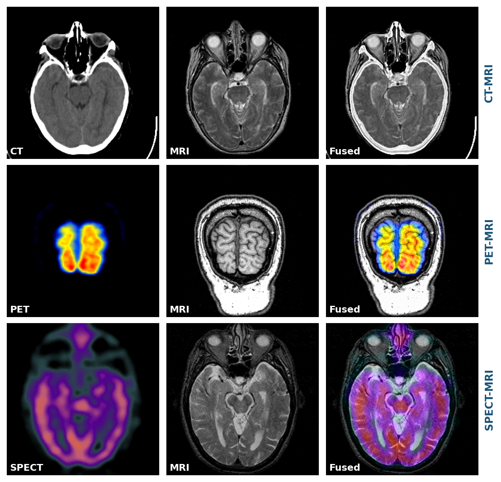
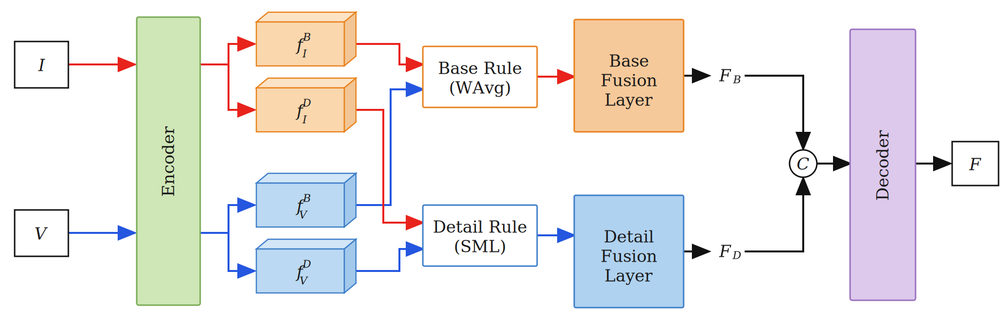
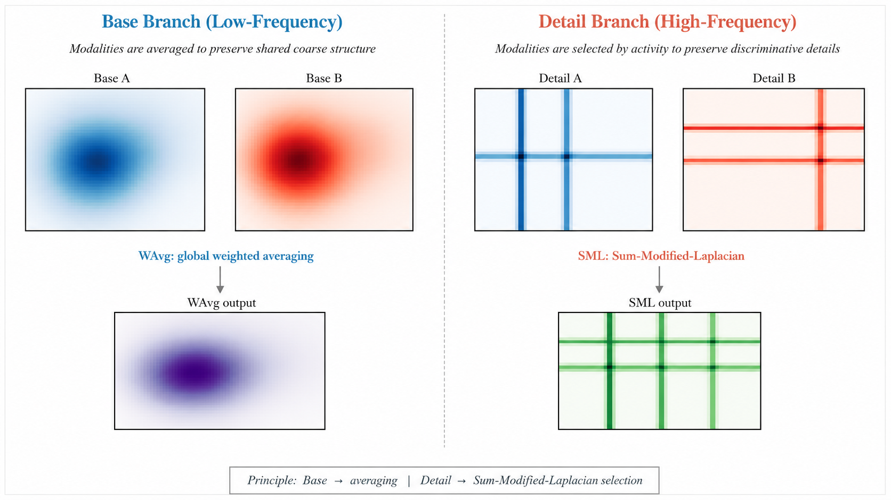
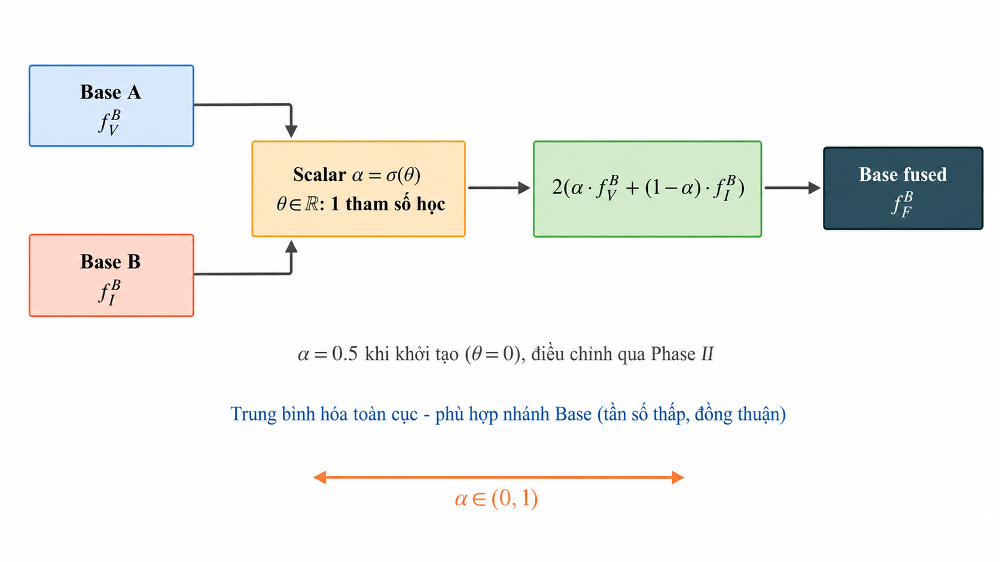
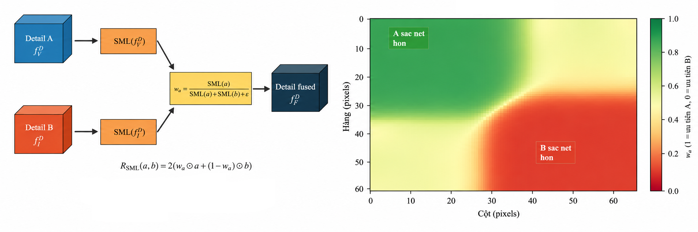
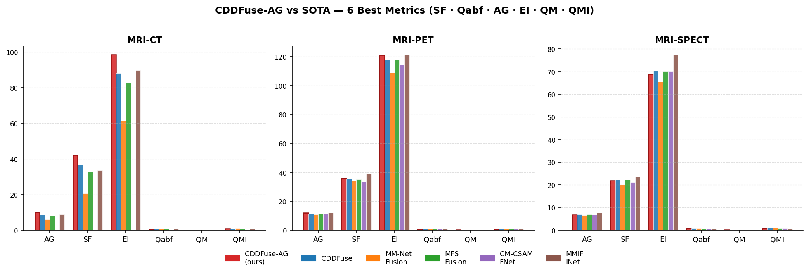
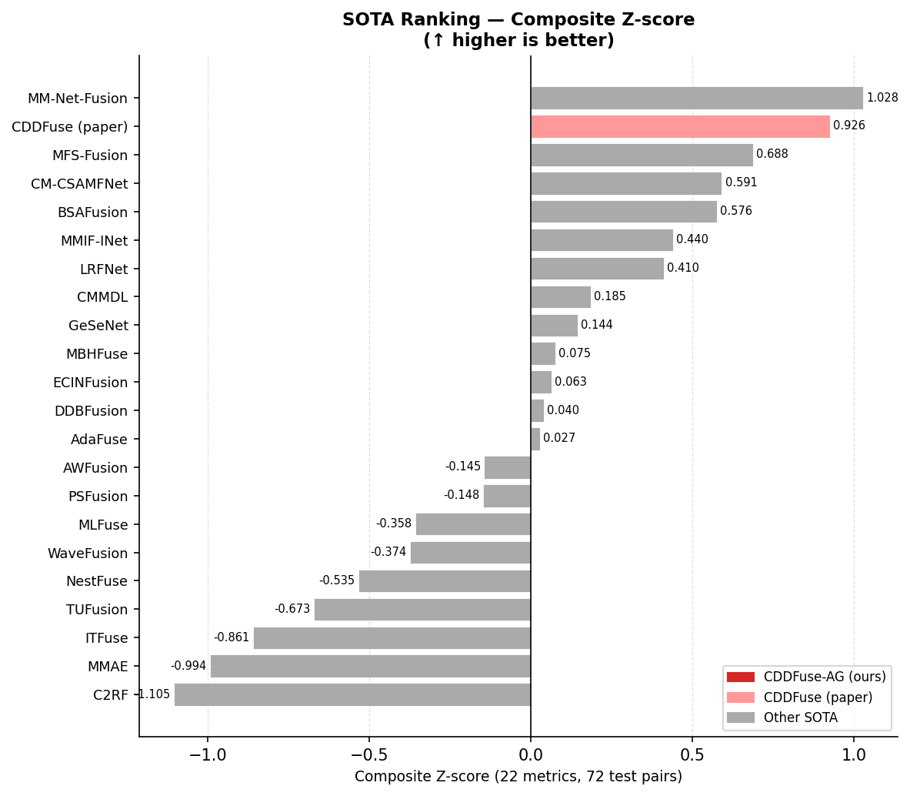
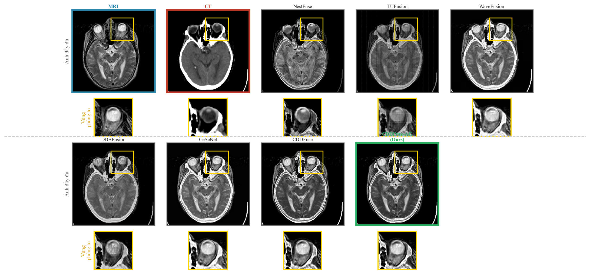
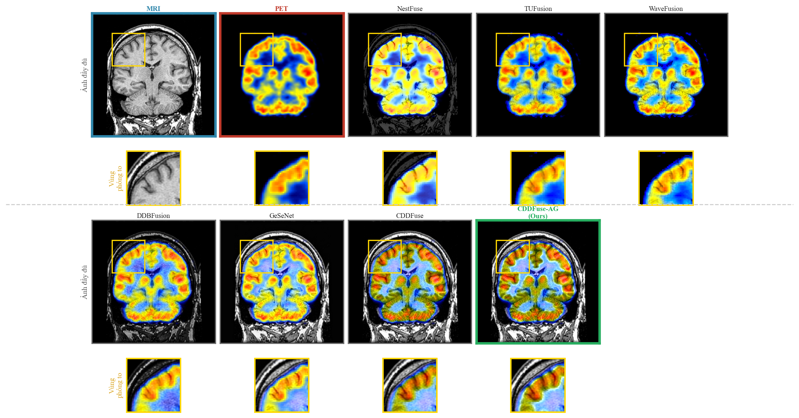
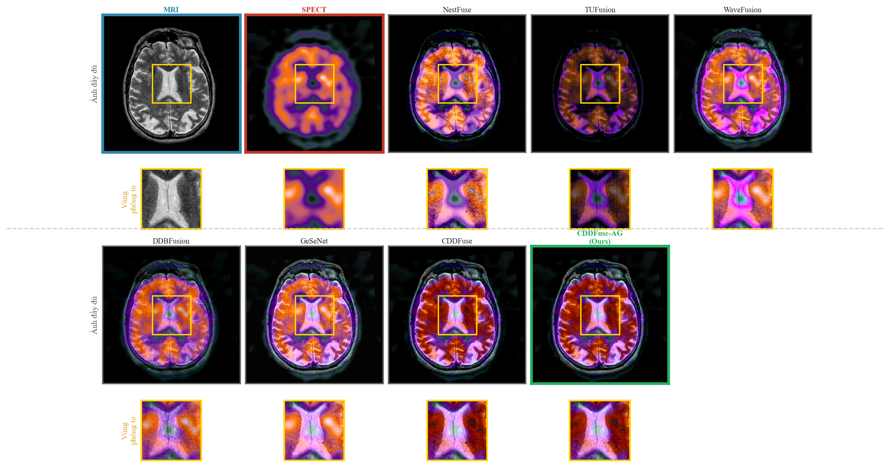

# CDDFuse-AG — Tổng hợp ảnh y tế đa phương thức với Asymmetric Fusion

[](https://www.python.org/downloads/)
[](https://pytorch.org/)
[](#)

> **Đồ án Tốt nghiệp — Đại học Bách Khoa Hà Nội (HUST)**
> Đề xuất mô hình CDDFuse-AG cho tổng hợp ảnh y tế đa phương thức
>
> **Sinh viên:** Đỗ Trung Kiên — MSSV 20224869
> **GVHD:** TS. Phạm Đăng Hải · PGS. TS. Phạm Văn Hải

---

## 1. Tổng quan



Tổng hợp ảnh y tế đa phương thức (Medical Image Fusion — MIF) kết hợp CT/PET/SPECT với MRI thành một ảnh duy nhất, giữ đồng thời thông tin cấu trúc giải phẫu và chức năng trao đổi chất. Đồ án cải tiến **CDDFuse** (CVPR 2023) bằng cách thay thế phép cộng đơn giản ở Fusion Layer bằng hai quy tắc chuyên biệt và **bất đối xứng**:

| Nhánh | CDDFuse (cũ) | CDDFuse-AG (đề xuất) |
|---|---|---|
| **Base** (tần số thấp, tương quan cao) | $f_V + f_I$ | **WAvg** — trung bình có trọng số 1 scalar $\theta$ học được |
| **Detail** (tần số cao, bổ trợ nhau) | $f_V + f_I$ | **SML** — lựa chọn cục bộ theo Sum-Modified-Laplacian |

Chỉ thêm **4.161 tham số** (~0.35% so với CDDFuse). Huấn luyện 2 pha trên Harvard MIF (738 cặp train, 72 cặp test).

---

## 2. Kiến trúc

### 2.1 Pipeline tổng thể



Encoder dùng chung trọng số (Restormer + INN) tách ảnh đầu vào thành thành phần Base và Detail. Fusion Layer áp dụng quy tắc **bất đối xứng**: WAvg cho Base, SML cho Detail. Decoder tái tạo ảnh tổng hợp.

### 2.2 Lý do thiết kế bất đối xứng



- **Base** (tần số thấp): hai modality có nội dung tương quan cao → trung bình hóa tối ưu hơn lựa chọn.
- **Detail** (tần số cao): hai modality bổ trợ nhau → chọn vùng sắc nét hơn tốt hơn trung bình.

### 2.3 Quy tắc WAvg (Base branch)



```
α = σ(θ),   θ ∈ ℝ  (1 tham số học duy nhất)
R_WAvg(a, b) = 2(α·a + (1−α)·b)
```

Init `θ=0` → `α=0.5` ≡ trung bình tại epoch 0. Học tỉ lệ đóng góp tối ưu end-to-end.

### 2.4 Quy tắc SML (Detail branch)



```
ML_ij(f) = |2f_ij − f_{i-1,j} − f_{i+1,j}| + |2f_ij − f_{i,j-1} − f_{i,j+1}|
SML_ij(f) = Σ_{N(i,j)} ML_pq(f)          # sum trên vùng 3×3

w_a = SML(a) / (SML(a) + SML(b) + ε)
R_SML(a, b) = 2(w_a ⊙ a + (1−w_a) ⊙ b)
```

Không có tham số học. Mỗi vị trí ưu tiên modality có cạnh sắc nét hơn.

---

## 3. Kết quả định lượng

### 3.1 So sánh 6 chỉ số tốt nhất



#### MRI-CT

| Method | SF | AG | EI | Qabf | QM | QMI |
|---|---|---|---|---|---|---|
| **CDDFuse-AG (ours)** | **42.074** | **9.898** | **98.416** | **0.645** | **0.015** | **0.794** |
| CDDFuse | 36.538 | 8.756 | 88.053 | 0.614 | 0.009 | 0.778 |
| MM-Net-Fusion | 20.614 | 6.072 | 61.625 | 0.539 | 0.008 | 0.966 |
| MFS-Fusion | 32.856 | 8.071 | 82.524 | 0.609 | 0.013 | 0.758 |
| MMIF-INet | 33.715 | 8.826 | 89.913 | 0.614 | 0.007 | 0.654 |
| BSAFusion | 28.822 | 7.542 | 77.589 | 0.536 | 0.007 | 0.788 |

CDDFuse-AG **#1 cả 6 chỉ số**. SF +15%, QM gần gấp đôi so với CDDFuse.

#### MRI-PET

| Method | SF | AG | EI | Qabf | QM | QMI |
|---|---|---|---|---|---|---|
| CDDFuse-AG (ours) | 35.779 | 11.922 | 121.140 | **0.764** | **0.232** | 0.809 |
| CDDFuse | 35.243 | 11.562 | 118.032 | 0.734 | 0.074 | 0.765 |
| MM-Net-Fusion | 34.179 | 10.851 | 108.919 | 0.797 | 0.035 | **0.890** |
| MFS-Fusion | 35.173 | 11.521 | 118.046 | 0.760 | 0.094 | 0.725 |
| CM-CSAMFNet | 33.566 | 11.145 | 114.546 | 0.765 | 0.049 | 0.760 |
| MMIF-INet | **38.978** | **11.934** | **121.333** | 0.719 | 0.026 | 0.677 |
| BSAFusion | 34.444 | 11.299 | 115.376 | 0.763 | 0.162 | 0.713 |

CDDFuse-AG **#1 trên 5/6 chỉ số**. QM +21.9% so với CDDFuse.

#### MRI-SPECT

| Method | SF | AG | EI | Qabf | QM | QMI |
|---|---|---|---|---|---|---|
| CDDFuse-AG (ours) | 21.849 | 6.848 | 68.918 | 0.751 | **0.091** | 0.919 |
| CDDFuse | 22.284 | 6.958 | 70.358 | 0.758 | 0.168 | **1.022** |
| MM-Net-Fusion | 20.013 | 6.516 | 65.581 | **0.767** | 0.050 | 0.964 |
| MFS-Fusion | 22.147 | 6.946 | 70.214 | 0.742 | 0.122 | 0.789 |
| CM-CSAMFNet | 21.187 | 6.820 | 70.150 | 0.693 | 0.040 | 0.767 |
| MMIF-INet | **23.590** | **7.629** | **77.444** | 0.716 | 0.044 | 0.690 |
| BSAFusion | 22.025 | 6.910 | 69.690 | 0.765 | 0.174 | 0.800 |

CDDFuse-AG **#1 trên 3/6 chỉ số**. QM +10.4% so với CDDFuse (SPECT đặc thù hơn, CDDFuse-AG kém hơn ở QMI).

#### Tổng hợp

| Modality | CDDFuse-AG #1 |
|---|---|
| MRI-CT | **6/6 chỉ số** |
| MRI-PET | **5/6 chỉ số** |
| MRI-SPECT | **3/6 chỉ số** |
| **Tổng** | **14/18 chỉ số** |

### 3.2 Xếp hạng Composite Z-score (22 SOTA, 22 chỉ số)



CDDFuse (pretrained paper) xếp **#2/22** toàn bảng — xác nhận backbone đủ mạnh để cải tiến.  
CDDFuse-AG retrain đạt **z avg = +0.344** trong nhóm 6 SOTA so sánh trực tiếp (CDDFuse retrain: +0.286).

---

## 4. Kết quả trực quan

### MRI-CT



### MRI-PET



### MRI-SPECT



---

## 5. Cài đặt

### Yêu cầu

| | Giá trị |
|---|---|
| Python | 3.10 |
| PyTorch | 2.5.1+cu121 |
| GPU | Tesla P100 (Kaggle) / RTX 30xx local |
| RAM | 16GB |

### Setup

```bash
git clone https://github.com/kienvbhp872004/MMIF-CDDFuse-AG.git
cd MMIF-CDDFuse-AG
pip install -r requirements.txt
pip install torch==2.5.1+cu121 torchvision --index-url https://download.pytorch.org/whl/cu121
```

---

## 6. Sử dụng

### Đánh giá checkpoint

```bash
cd models/MMIF-CDDFuse

# Eval CDDFuse baseline
python evaluate_cddfuse.py --modal CT --ckpt models/CDDFuse_MIF.pth \
    --harvard_root ../../data/reference --out_dir ../../results_v2/CDDFuse

# Eval CDDFuse-AG
python evaluate_cddfuse.py --variant Comb-WAvg-SML --modal CT \
    --ckpt models/CDDFuse-AG.pth \
    --harvard_root ../../data/reference --out_dir ../../results_v2/CDDFuse-AG
```

### Huấn luyện

```bash
python dataprocessing_MIF.py       # tiền xử lý → h5 patches
python train_MIF.py --variant Comb-WAvg-SML --amp --num_epochs 120 --batch 8
```

Wall time: ~3-5 giờ trên Kaggle Tesla P100.

---

## 7. Ablation Study

Khảo sát hệ thống **13 quy tắc tổng hợp** theo one-factor-at-a-time:

| Stage | Khảo sát | Winner |
|---|---|---|
| **1 — Base rule** | 5 quy tắc: Sum, Mean, WAvg, Gated, CrossAttn (giữ Detail=Sum) | **WAvg** (#1 CT) |
| **2 — Detail rule** | 8 quy tắc: Sum, Mean, SML, Max, MoE, … (giữ Base=Sum) | **SML** (ổn định nhất 3 modality) |
| **3 — Kết hợp** | Sym-AG vs Asym (WAvg+SML) | **Asym** thắng 10/18 |

Thiết kế **đối xứng** (Sym-AG: WAvg cả hai nhánh) yếu hơn bất đối xứng — xác nhận vai trò khác nhau của Base/Detail.

---

## 8. Cấu trúc repo

```
MMIF-CDDFuse-AG/
├── models/
│   ├── MMIF-CDDFuse/           # CDDFuse + CDDFuse-AG source code
│   │   ├── net.py              # Encoder, Decoder, Restormer blocks
│   │   ├── fusion_rules.py     # WAvg, SML và các quy tắc ablation
│   │   ├── train_MIF.py        # Training script (2-phase, 120 epoch)
│   │   └── evaluate_cddfuse.py
│   └── <22 SOTA models>/
│
├── data/reference/             # 72 cặp ảnh test (24 × CT/PET/SPECT)
│
├── results_v2/
│   ├── CDDFuse-AG-45ep/        # Mô hình đề xuất (Comb-WAvg-SML)
│   ├── CDDFuse/                # Baseline retrain
│   ├── <22 SOTA>/
│   ├── _compare_vs_sota/       # Per-modal & composite ranking CSVs
│   ├── zscore_ranking.csv
│   └── PROGRESS.md
│
├── docs/figures/               # Figures dùng trong README
│
├── report_latex/               # Báo cáo ĐATN (LaTeX + PDF)
├── paper_nckh/                 # Paper NCKH (A4, single-column)
├── presentation_latex/         # Slide bảo vệ (Beamer HUST RED 16:9)
├── 20224869-DoTrungKien-DATN/  # Thư mục nộp đồ án
└── dev/                        # Tooling phân tích & gen figures
```

---

## 9. Tài liệu

| File | Mô tả |
|---|---|
| [`report_latex/main.pdf`](report_latex/main.pdf) | Báo cáo đồ án đầy đủ |
| [`paper_nckh/main.pdf`](paper_nckh/main.pdf) | Paper NCKH (A4, 1 cột) |
| [`presentation_latex/CDDFuse_AG_Slide.pdf`](presentation_latex/CDDFuse_AG_Slide.pdf) | Slide bảo vệ ĐATN |
| [`results_v2/PROGRESS.md`](results_v2/PROGRESS.md) | Nhật ký thực nghiệm |

---

## 10. Tác giả

- **Sinh viên:** Đỗ Trung Kiên — MSSV 20224869
- **Trường:** Đại học Bách Khoa Hà Nội — Khoa học máy tính, Trường CNTT & Truyền thông
- **GVHD:** TS. Phạm Đăng Hải · PGS. TS. Phạm Văn Hải
- **Email:** kien.dt224869@sis.hust.edu.vn
- **GitHub:** [kienvbhp872004/MMIF-CDDFuse-AG](https://github.com/kienvbhp872004/MMIF-CDDFuse-AG)

---

## 11. License

Mã nguồn công khai phục vụ mục đích học thuật và nghiên cứu. Không sử dụng cho mục đích thương mại.

- CDDFuse gốc: Zhao et al., CVPR 2023
- Dataset Harvard MIF: Harvard Medical School
